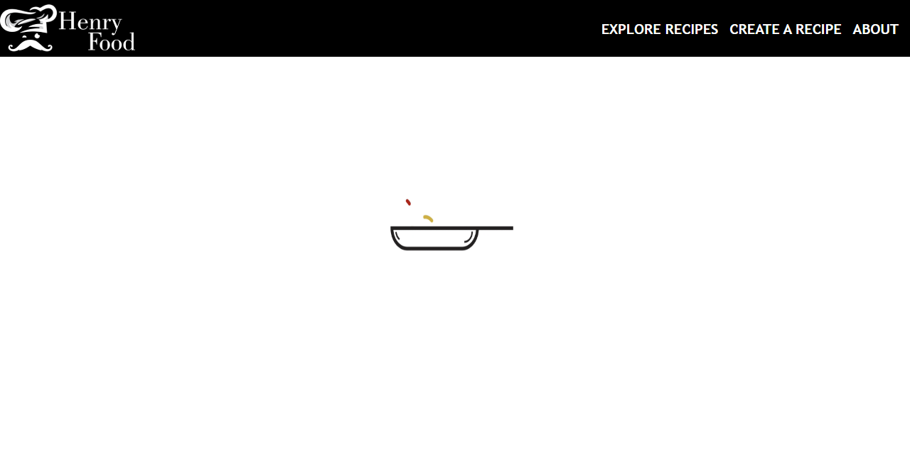

# Proyecto Individual - Henry Food

  

## Objetivos del Proyecto

- Construir una App utlizando React, Redux, Node y Sequelize.
- Afirmar y conectar los conceptos aprendidos en la carrera.
- Aprender mejores prácticas.
- Aprender y practicar el workflow de GIT.
- Usar y practicar testing.
- El proyecto tendrá una duración máxima de tres semanas.

#### Tecnologías utilizadas:
- [ ] React
- [ ] Redux
- [ ] Express
- [ ] Sequelize - Postgres

## Imagenes del proyecto
 
<h2 align="left">
Landing Page
</h2>

  

 
<h2 align="left">
Home
</h2>

  

 
<h2 align="left">
Animacion de carga
</h2>

  

 
<h2 align="left">
Detalle de la receta
</h2>

  

 
<h2 align="left">
Crear una receta
</h2>

  

 
<h2 align="left">
Acerca del proyecto
</h2>

  

 
 
<h1>Muchas gracias por ver el proyecto 😁👋</h1>